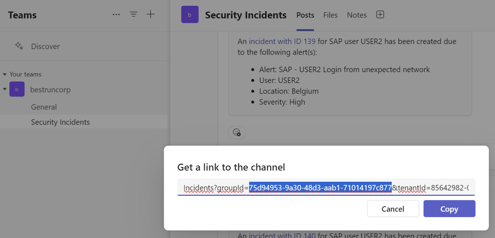
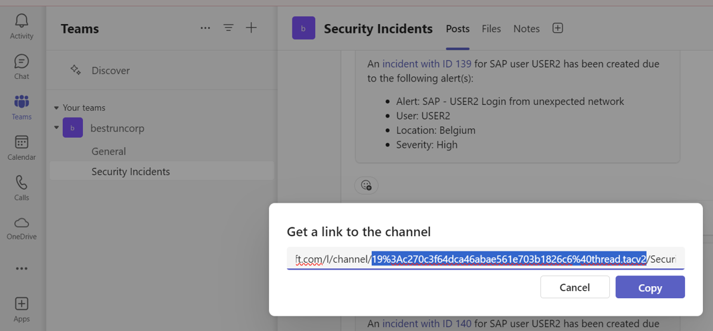
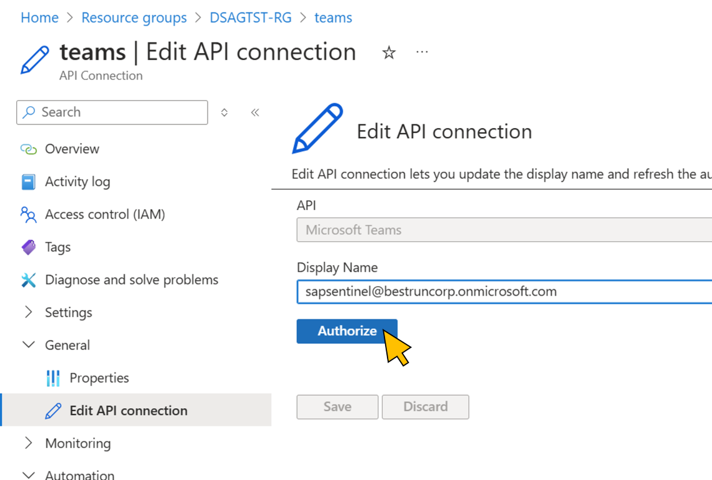

# How to prepare the environment for the hands-on workshop

[< Mentor Guide ](../../mentor/) - **[🏠Home](../../README.md)**

This folder contains the scripts to automate the setup for the workshop.

## Create Student VMs (optional if hackers are supposed to use their own devices)

The shell script using [create_student_vms.sh](./env-prep/create_student_vms.sh) scales creation of VMs based off of a single fully configured one.

### Step 1: Create a single VM as a template

Pay attention the naming convention highlighted in above script.

#### Required software on the student VMs

- [Git Client](https://git-scm.com/downloads)
- [PowerShell 7.4+](https://learn.microsoft.com/powershell/scripting/overview)
- [Podman (check box for WSLv2 installation if not present)](https://podman.io/docs/installation#windows)

Handle WSL installation for Podman with below hints:

- Use "Turn Windows Features on or off" app to enable "Virtual Machine Platform" and "Windows Subsystem for Linux".
- Perform a VM restart
- kick off the WSL installation through powershell with below command:

```powershell
podman machine init
```

> [!TIP]
> In some cases initial run of podman fails with missing hosts file. You may fix by adding the empty file C:\Users\{username}\.ssh\known_hosts.

Ensure a functional setup by running the [podman commands](../student/quest1.md#step-1-start-evilginx3-process) till evilginx starts.

Consider removing the podman machine after your test with below commands:

```powershell
podman machine list
podman machine rm podman-machine-default
```

#### Step 2: Create a lot of VMs based on the template

- Create a snapshot of the disc of the template VM.
- Adjust the script to your needs (VM size, number of VMs, etc.)
- Run the script

## Create Azure Users

The shell script [provision-azure-users.sh](./env-prep/provision-azure-users.sh) creates arbitrary number of Azure users. The script uses the Azure CLI to create users and assign them to a group.

## Create SAP Users

Import the ABAP program [create-sap-users.abap](./env-prep/create-sap-users.abap) into the SAP system and use the [CSV file](./env-prep/users.csv) for mass user creation.

Ensure the email addresses match the UPNs of the Azure users for SSO between SAP and EntraID.

## Deploy Playbooks (aka Azure LogicApps) on Azure

### Step 1: Configure environment variables

Configure your environment variables with the file [env.sh](./env.sh).

For your Teams Channel ID (parameter `TEAMS_GROUP_ID`), login to Teams, go to your Teams channel, click on the context menu, and select **Get link to channel**. Copy the group id from the link:

<p align="center" width="100%">

</p>

Copy the Channel ID from the same link. [URL-decode](https://www.urldecoder.io/) the string before saving it in the env.sh file.

<p align="center" width="100%">

</p>

### Step 2: Login to Azure

In a Linux shell, run `az login`

### Step 3: Provision users in Entra ID tenant

Change the directory to `.\mentor\env-prep`.

Run the script [`.\provision-azure-users.sh`](./provision-azure-users.sh)

### Step 4: Deploy playbooks

Run the script [`.\deploy_playbooks.sh`](./deploy_playbooks.sh)

Upon successful deployment of the resources, go to the newly created resource group in the [Azure Portal](https://portal.azure.com) and open the API connection `teams`. Select **General -> Edit API connection** and click **Authorize**. Login to Entra ID with the user used for the Teams connection. Click **Save**.

<p align="center" width="100%">

</p>

### Step 5: Provision users in SAP

- Login to SAP (e.g. with user DEVELOPER in a CAL instance)
- Run SE38
- Create a new ABAP program with file [`create-sap-users.abap`](./create-sap-users.abap)
- Edit file [`users.csv`](./users.csv) according to the number of users
- Run the ABAP program from SE38

[< Mentor Guide ](../../mentor/) - **[🏠Home](../../README.md)**

[🔝](#)
