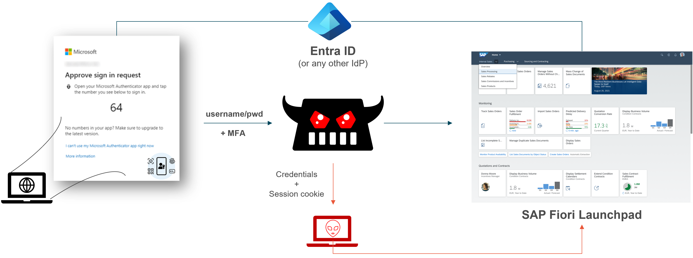

# Quest 0 - Introduction

**[🏠Home](../README.md)** - [ Quest 1 >](quest1.md)

Every day we log on and authenticate to websites -- obviously also to SAP systems, like the SAP Fiori Launchpad. In the meantime we know that using only username and password is not good enough, so Multi-Factor Authentication (MFA) is luckily being used by most users.

As you will see in this hands-on lab, even that might not be good enough!

## The Target: SAP Fiori Launchpad

Before we install anything and get started, lets take a look at our target system. Open the SAP Fiori Launchpad provided to you. It looks something like this with a proper domain of course.

```plaintext
https://your-sap-domain:port/sap/bc/ui5_ui5/ui2/ushell/shells/abap/FioriLaunchpad.html?sap-client=001&sap-language=EN&spnego=disabled#Shell-home
```

You will be redirected to the Entra-ID Login page. Once you are authenticated, you can access the SAP Fiori Launchpad with all the roles and permissions that are assigned to your user.

<p align="center" width="100%">

</p>

> [!NOTE]
> In such lab environments MFA is often not configured, because otherwise all participants would have needed to run through the setup process with their own mobile phone and the Microsoft Authenticator app.

## The evil proxy

So far, so good. In the next quests we will make sure that a users will actually click on a link that will not directly go to the SAP Fiori Launchpad, but will be proxied to an "Adversary in the middle" (AitM). This AitM has now the chance to trace all traffic and capture the relevant session cookies which later can be used to authenticate -- without knowing any user credentials.

## Where to next?

**[🏠Home](../README.md)** - [ Quest 1 >](quest1.md)

[🔝](#)
