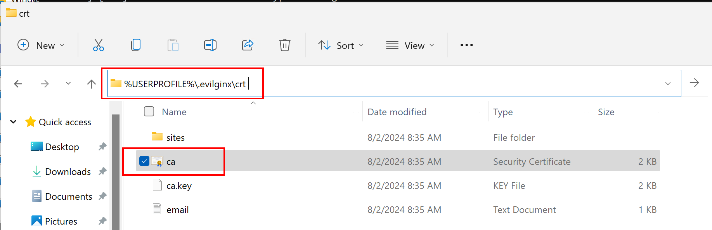

# Quest 1 - Buckle up!

**[🏠Home](../README.md)** - [ Quest 2 >](quest2.md)

In this tutorial, you will perform basic deployments to set up your environment for the hands-on lab. You will also learn how to install a phishing simulation tool to prepare for the next quest.

## Installation for hands-on lab

### Step 0: Consider using a virtual sandbox to keep your machine "clean"

A common practice for "playing" with hacking tools is to utilize an isolated environment. This can be a virtual machine or a container. This way, you can keep your main machine clean and avoid any unintended consequences. Below are a couple of suggestions.

* Local virtual machines (embedded in your physical device)
    * [Hyper-V on Windows 10](https://docs.microsoft.com/virtualization/hyper-v-on-windows/quick-start/enable-hyper-v) or
    * [VirtualBox](https://www.virtualbox.org/) or similar.
* Remote virtual machines (Hyperscaler options)
    * Spin up environments with [Azure VMs](https://azure.microsoft.com/free/) with free credits or
    * Any other available to you.
* Containerized options
    * Use environments like [Docker](https://www.docker.com/products/docker-desktop) on Windows or
    * Podman on linux.

Our guidance here refers to a windows environment on an Azure VM. You can adjust the steps to your environment.

### Step 1: Install Evilginx3

Find the documentation for the tool [here](https://help.evilginx.com/docs/intro).

Install [git](https://git-scm.com/downloads) if you haven't already.

```bash
git clone https://github.com/kgretzky/evilginx2.git
```

> [!TIP]
> If you have not installed a Git client, you can also go directly to the [Evilginx3 repo](https://github.com/kgretzky/evilginx2), click on *Code* and *Download ZIP*. Once the ZIP file is downloaded extract it to your virtual machine. 

> [!IMPORTANT]
> Many of you will run into Defender detections with the executable upon [download](https://github.com/kgretzky/evilginx2/releases). Consider building the tool from source in such cases.

#### Build from source

- Install [golang](https://go.dev/doc/install)
- Restart your terminal and verify the installation with `go version` command.

```bash
cd evilginx2
.\build_run.bat
```

- Allow Access on subsequent Defender firewall prompt like a vigilante in the making.

#### (Alternative) Install the pre-built version

In case you are lucky you can follow the normal install steps:

- Get the latest release from the [releases page](https://github.com/kgretzky/evilginx2/releases) (Assets -> evilginx*-64bit.zip) and follow the [quick start guide](https://help.evilginx.com/docs/getting-started/deployment/local).

- Allow Access on subsequent Defender firewall prompt like a vigilante in the making.

### Step 2: Configure Evilginx3

```bash
config ipv4 127.0.0.1
config domain dsag-red-team.com
```


> [!NOTE]
> hackers use elusive domains like 'microsofttonline.com' to trick users. Outlook and M365 pick up such attempts, but other email clients may not. Note we use a domain that is not registered and only used for this tutorial.

- Find the root certificate in the `User` folder (%USERPROFILE%\\.evilginx\crt) and install it on your machine.


- Add this certificate to the Trusted Root Certificate Authorities store of the Current User. Otherwise, you will get a certificate error when accessing the phishing page.

You may need to restart your machine for the changes to take effect.

### Step 3: Create or retrieve a phishlet for your scenario

We will use a sample phishlet for M365 shared by [Jan Bakker](https://github.com/BakkerJan/evilginx3/blob/main/microsoft365.yaml).

- Download it or find it in the `assets` folder of this repository [here](assets/m365-phishlet.yaml).
- Place the phishlet by placing it in `.\evilginx2\phishlets` folder of the prior cloned repos `evilginx2`. It contains the example phishlet.

Restart your instance for the changes to take effect like so:

```bash
q
build_run.bat
```

- Verify the M365 phishlet is now showing up.


> [!TIP]
> Always check for updates on the phishlets and the tool itself. Things are changing rapidly in the security world.

### Step 4: Prepare your phishing lure

```bash
phishlets hostname microsoft365 dsag-red-team.com
phishlets enable microsoft365 
```


#### Enhance hosts file for local testing

```bash
phishlets get-hosts microsoft365
```


- Add the output to your hosts file located at `C:\Windows\System32\drivers\etc\hosts`. You will need admin rights to edit this file.


#### Create your phishing lure

```bash
lures create microsoft365
lures get-url 0
```


- Open the URL in your browser to see the phishing page.
- Check the Evilginx3 console for the captured output so far ("new visitor has arrived" etc.).


## Where to next?

**[🏠Home](../README.md)** - [ Quest 2 >](quest2.md)

[🔝](#)
