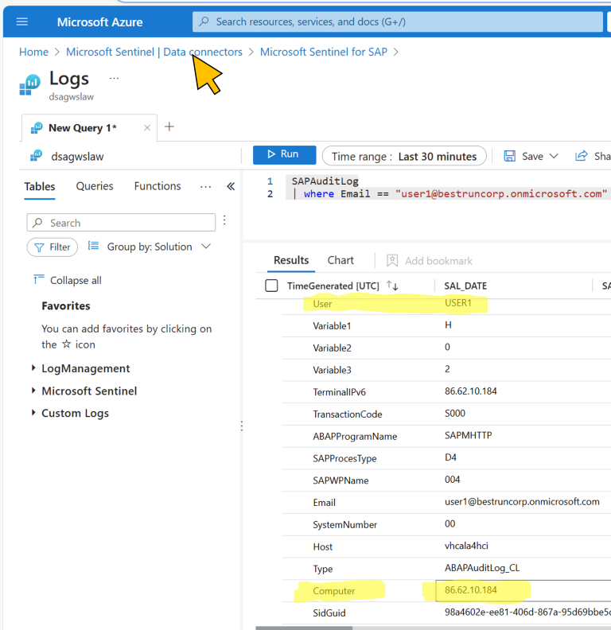
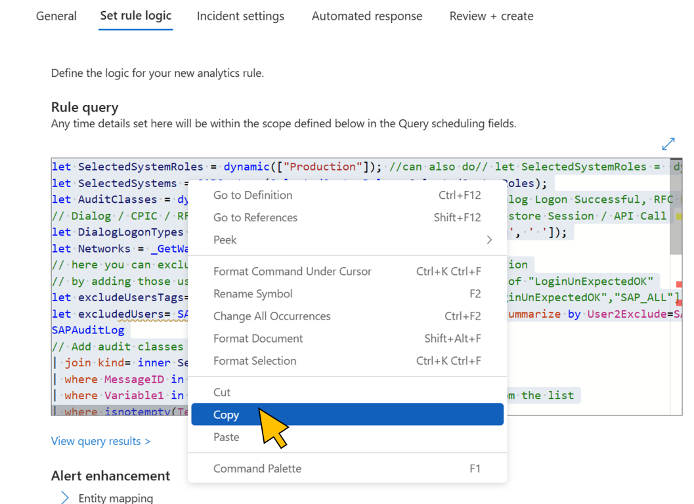

# Quest 3 - Analyze the catch with Sentinel for SAP and support remediation

[< Quest 2 ](quest2.md) - **[🏠Home](../README.md)** - [ Quest 4 >](quest4.md)

In quest 2 you have logged in to SAP using the Fiori Launchpad. That action leaves a trail on the SAP audit log. SIEM tools like [Microsoft Sentinel](https://learn.microsoft.com/en-us/azure/sentinel/) can pick this up and run automatic analytics on it. In this quest, you will analyze your log entry, identify the out-of-the-box rule that fired on your activity, and create a playbook (aka [Azure LogicApps](https://learn.microsoft.com/en-us/azure/logic-apps/)) to forward the alert to your SOC ([Security Operations Center](https://www.microsoft.com/en-us/security/business/security-101/what-is-a-security-operations-center-soc)) Microsoft Teams channel for notification.

### Login to Azure Portal
Login with your user (e.g. user1@bestruncorp.onmicrosoft.com) to the [Azure Portal](https://portal.azure.com).
<p align="center" width="100%">

</p>

### Open Microsoft Sentinel 
In the search bar, enter "Sentinel", and click on Microsoft Sentinel under the search results.
<p align="center" width="100%">

</p>

Microsoft Sentinel leverages Log Analytics Workspaces ([LAW](https://learn.microsoft.com/en-us/azure/azure-monitor/logs/log-analytics-workspace-overview)) as a fundamental component for its operations. Essentially, Log Analytics Workspaces serve as a logical container for logs, enabling Sentinel to collect, analyze, and act on telemetry data from various sources, including Azure and on-premises environments.

Select the **dsagwslaw** LAW.
<p align="center" width="100%">

</p>

### Inspect the SAP Audit Log data in Sentinel
Microsoft Sentinel uses the [Data Connector for SAP Solutions](https://learn.microsoft.com/en-us/azure/sentinel/sap/solution-overview) to enhance its monitoring and security capabilities for SAP systems. This integration allows Sentinel to ingest and analyze data from SAP environments, providing comprehensive visibility and threat detection across all layers of the SAP ecosystem.

Click **Data Connectors** from the navigation menu, select the **Microsoft Sentinel for SAP** connector from the list, and click on **Open connector page**.
<p align="center" width="100%">

</p>

Select the **SAPAuditLog** entry from the data types collected by the connector.
<p align="center" width="100%">

</p>

In the logs query start by changing the time range to the last 30 minutes.
<p align="center" width="100%">

</p>

Microsoft Sentinel uses the Kusto Query Language ([KQL](https://learn.microsoft.com/en-us/azure/sentinel/kusto-overview)) extensively to perform various tasks such as searching, analyzing, and visualizing data. KQL is a powerful tool designed to work with large datasets in Azure, and it is used by several Azure services, including Azure Monitor, Azure Data Explorer, and Microsoft Sentinel.

To query the SAP Audit Log for logins of your user (e.g. user1@bestruncorp.onmicrosoft.com), change the KQL expression as by adding a *where* clause. Then click **Run**.
<p align="center" width="100%">

</p>

Inspect the latest entry in the query result which shows the attacker's login with the stolen cookie of your user. Notice the *User* and *Computer* data fields. Since the IP address of the attacker is **NOT** in the range of your corporate network you will use this data to automate the threat detection with Sentinel.

Go back to the Sentinel main navigation menu by clicking the link in the breadcrumb navigation.
<p align="center" width="100%">

</p>

### Automate threat detection for the scenario with an Analytic Rule
Sentinel uses built-in and custom analytics rules to detect threats. These rules are based on known attack patterns and behaviors, and they continuously analyze data from various sources to identify suspicious activities.

Let's start this journey by inspecting the current entries for the expected network ranges of *legitimate* login requests to your SAP system.

Select **Watchlist** from the navigation menu and enter "Networks" in the search bar. Click on "SAP - Networks" from the search results.

Click the **Update watchlist** button and select **Edit watchlist items**.
<p align="center" width="100%">

</p>

The **SAP - Networks** watchlist currently contains one entry which represents the network range of IP addresses of *authorized clients* from the corporate network. Leave the entry as-is and go back to the main menu by clicking the **Microsoft Sentinel** entry in the breadcrumb navigation.
<p align="center" width="100%">

</p>

Select **Analytics** from the menu and switch to the **Rule templates** tab.

Search for a built-in rule template to detect logins from unexpected networks by entering "Login from" in the search bar. On the "SAP - Login from unexpected network" built-in rule, select **Create rule**. 
<p align="center" width="100%">

</p>

Change the name of your new analytic rule by adding your user name to it, e.g. "SAP - **User1** login from unexpected network". Optionally, change the description accordingly.

Click **Next: Set rule logic**.
<p align="center" width="100%">

</p>

Select the default Kusto query from the built-in rule and copy it to the clipboard. 
<p align="center" width="100%">

</p>

To avoid interference with the other users we only want to detect threats for your specific user. Therefore, the query must be changed accordingly. 

You can seek help from [Microsoft Copilot](https://copilot.microsoft.com/) by entering the a prompt like *"How do I change the following Kusto query to filter only audit log message for a specific user?"*, followed by the built-in query you copied before to the clipboard.  
<p align="center" width="100%">

</p>

Copilot will add the required expressions to the built-in query. Check the proposed query to see if it fits and copy it into the clipboard.
<p align="center" width="100%">

</p>

Replace the rule logic with the Copilot proposal from the clipboard. 

Change the placeholder in the variable definition (here "your_specific_user")

```bash
let specificUser = "your_specific_user"
```

with the SAP user name, e.g. *"USER1"*.

Change the **Query scheduling** settings to run the query every 5 minutes on SAP Audit Log data not older than 30 minutes. This time range should cover the audit log data captured from the successful attack at the end of [Quest 2](quest2.md).

Click **Next: Incident settings**.
<p align="center" width="100%">

</p>

Leave the settings unchanged and click **Next: Automated response**.
<p align="center" width="100%">

</p>

Create a new automation rule for sending the notification to the SOC via Microsoft Teams by clicking **Add new**.
<p align="center" width="100%">

</p>

Enter a name for your rule that identifies the user, e.g. *"User1 - Send notification to Teams"*. 

Select **Run playbook** from **Actions**.

Select the playbook for your user (e.g. *PlaybookUnexpectedNetworkLogin**User1***) from the list of playbooks. You will take a closer look at the playbook in [Quest 5](quest5.md) and enhance it with additional logic.

Click **Apply**.
<p align="center" width="100%">

</p>

Click **Next: Review + create**.
<p align="center" width="100%">

</p>

After the validation has passed, click **Save**.
<p align="center" width="100%">

</p>

You've created a new analytics rule for the attack scenario.
<p align="center" width="100%">

</p>

## Update the [leaderboard](https://forms.office.com/r/aYH8rh7vp5) with your progress⏱

Let's see the new rule in action!

## Where to next?

[< Quest 2 ](quest2.md) - **[🏠Home](../README.md)** - [ Quest 4 >](quest4.md)

[🔝](#)
