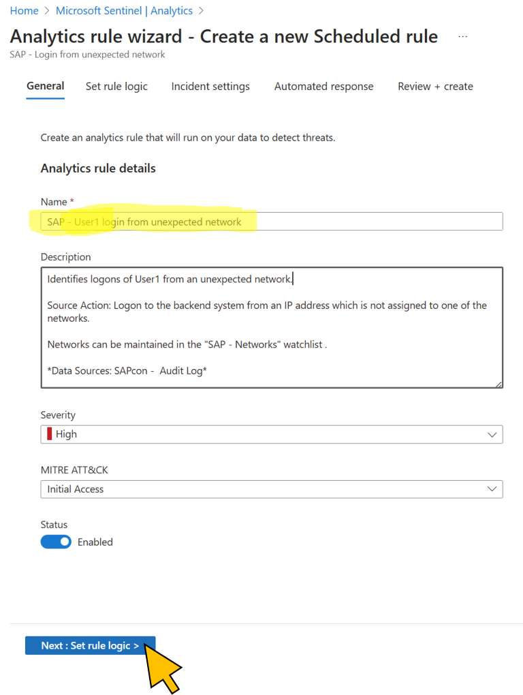
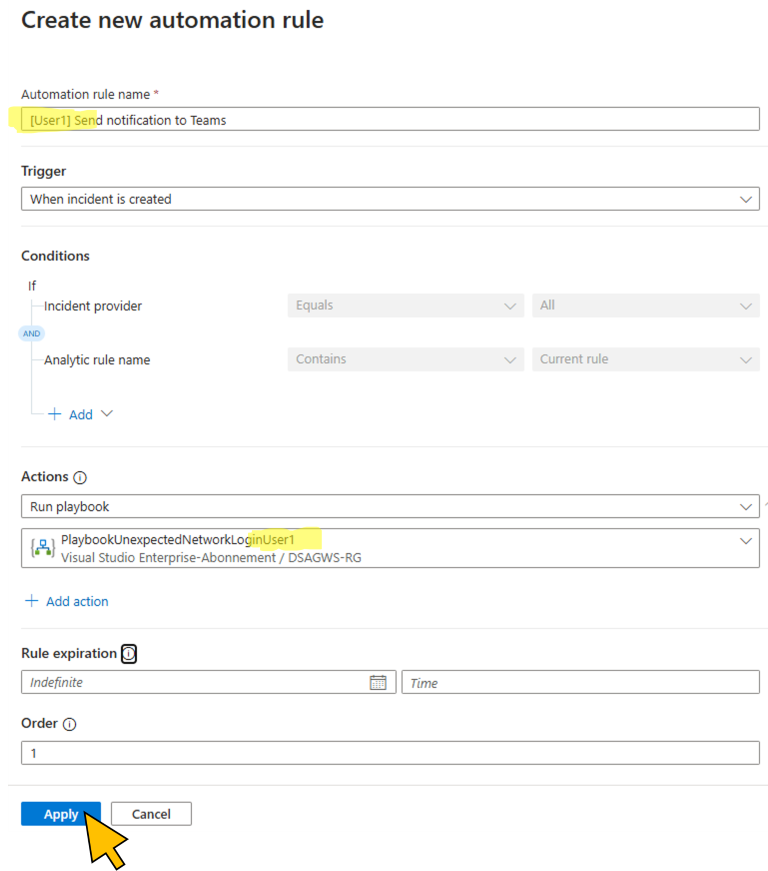

# Quest 3 - Analyze the catch with Sentinel for SAP and support remediation

[< Quest 2 ](quest2.md) - **[🏠Home](../README.md)** - [ Quest 4 >](quest4.md)

In quest 2 you have logged in to SAP using the Fiori Launchpad. That action leaves a trail on the SAP audit log. SIEM tools like [Microsoft Sentinel](https://learn.microsoft.com/en-us/azure/sentinel/) can pick this up and run automatic analytics on it. In this quest, you will analyze your log entry, identify the out-of-the-box rule that fired on your activity, and create a playbook (aka [Azure LogicApps](https://learn.microsoft.com/en-us/azure/logic-apps/)) to forward the alert to your SOC ([Security Operations Center](https://www.microsoft.com/en-us/security/business/security-101/what-is-a-security-operations-center-soc)) Microsoft Teams channel for notification.

### Login to Azure Portal
Login with your user (e.g. user1@bestruncorp.onmicrosoft.com) to the [Azure Portal](https://portal.azure.com).

### Open Microsoft Sentinel 
In the search bar, enter "Sentinel", and click on Microsoft Sentinel under the search results.

Microsoft Sentinel leverages Log Analytics Workspaces ([LAW](https://learn.microsoft.com/en-us/azure/azure-monitor/logs/log-analytics-workspace-overview)) as a fundamental component for its operations. Essentially, Log Analytics Workspaces serve as a logical container for logs, enabling Sentinel to collect, analyze, and act on telemetry data from various sources, including Azure and on-premises environments.

Select the **dsagwslaw** LAW.

### Inspect the SAP Audit Log data in Sentinel
Microsoft Sentinel uses the [Data Connector for SAP Solutions](https://learn.microsoft.com/en-us/azure/sentinel/sap/solution-overview) to enhance its monitoring and security capabilities for SAP systems. This integration allows Sentinel to ingest and analyze data from SAP environments, providing comprehensive visibility and threat detection across all layers of the SAP ecosystem.

Click **Data Connectors** from the navigation menu, select the **Microsoft Sentinel for SAP** connector from the list, and click on **Open connector page**.

Select the **SAPAuditLog** entry from the data types collected by the connector.

In the logs query start by changing the time range to the last 30 minutes.

Microsoft Sentinel uses the Kusto Query Language ([KQL](https://learn.microsoft.com/en-us/azure/sentinel/kusto-overview)) extensively to perform various tasks such as searching, analyzing, and visualizing data. KQL is a powerful tool designed to work with large datasets in Azure, and it is used by several Azure services, including Azure Monitor, Azure Data Explorer, and Microsoft Sentinel.

To query the SAP Audit Log for logins of your user (e.g. user1@bestruncorp.onmicrosoft.com), change the KQL expression as by adding a *where* clause. Then click **Run**.

### Step 8: Lorem ipsum
Lorem ipsum

### Step 9: Lorem ipsum
Lorem ipsum

### Step 10: Lorem ipsum
Lorem ipsum

### Step 11: Lorem ipsum
Lorem ipsum

### Step 12: Lorem ipsum
Lorem ipsum

### Step 13: Lorem ipsum
Lorem ipsum

### Step 14: Lorem ipsum
Lorem ipsum

### Step 15: Lorem ipsum
Lorem ipsum

### Step 16: Lorem ipsum
Lorem ipsum

### Step 17: Lorem ipsum
Lorem ipsum

### Step 18: Lorem ipsum
Lorem ipsum

### Step 19: Lorem ipsum
Lorem ipsum

### Step 20: Lorem ipsum
Lorem ipsum

### Step 21: Lorem ipsum
Lorem ipsum

### Step 22: Lorem ipsum
Lorem ipsum

## Where to next?

[< Quest 2 ](quest2.md) - **[🏠Home](../README.md)** - [ Quest 4 >](quest4.md)

[🔝](#)
