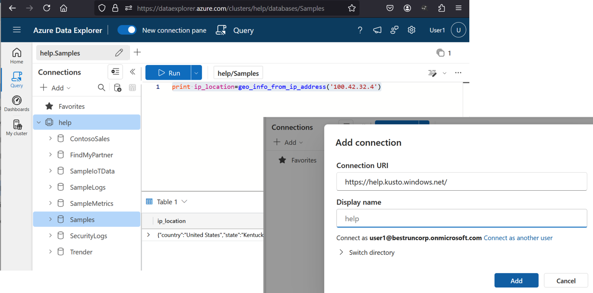
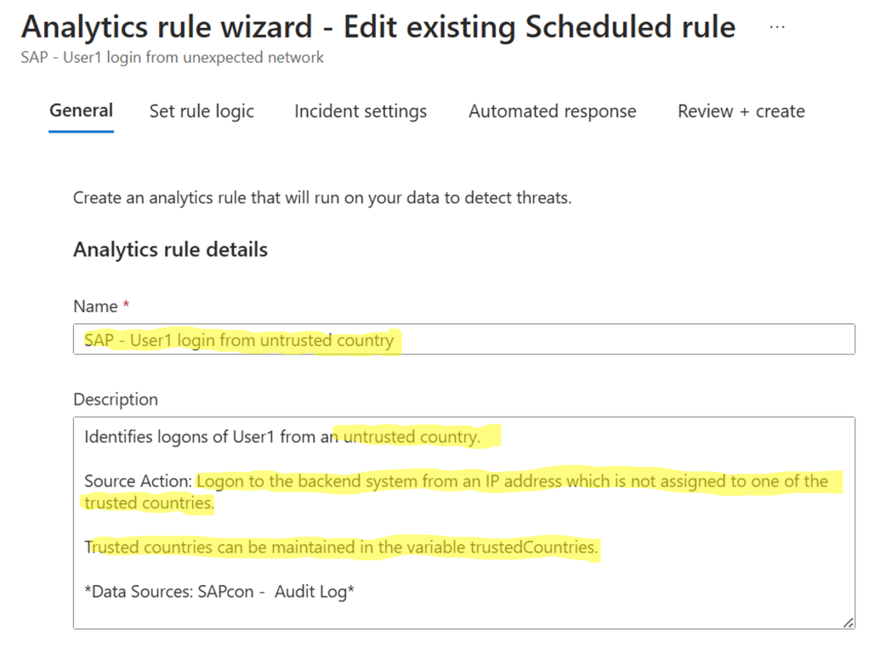
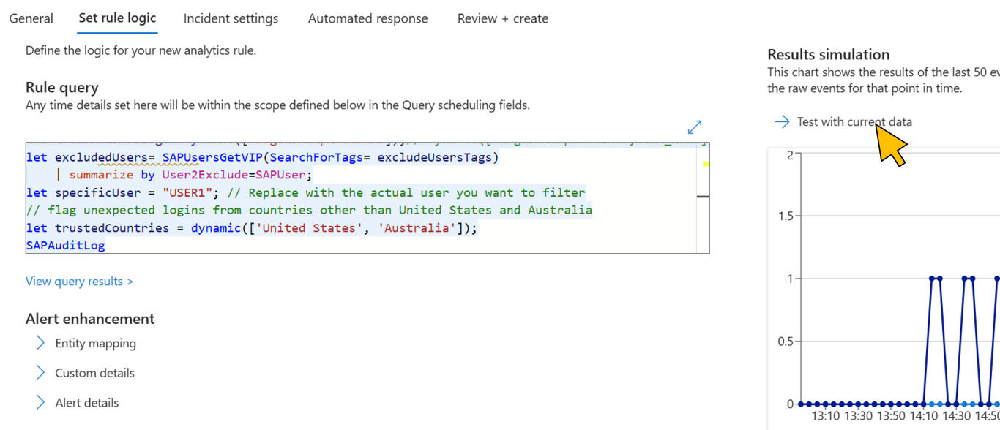

# Quest 4 - Create a custom detection rule (Experts | optional)

[< Quest 3 ](quest3.md) - **[🏠Home](../README.md)** - [ Quest 5 >](quest5.md)

Standard out-of-the-box detections are great, but sometimes you need to create a custom detection rule to catch a specific threat. In the [previous quest](quest3.md), you alerted on static pre-configured IP ranges. Now, we will expand scope and think global access.

* Use built-in KQL functions like [`geo_info_from_ip_address`](https://learn.microsoft.com/kusto/query/geo-info-from-ip-address-function?view=azure-data-explorer&preserve-view=true) to create a detection that alerts on logins from countries other than the company's known office locations, which are only in the `United States` and `Australia`.

* Take inspiration from [this blog post](https://community.sap.com/t5/technology-blogs-by-members/nice-patch-sap-revisiting-your-sap-btp-security-measures-after-ai-core/ba-p/13770662).

* You may want to get started by editing your existing analytic rule and add a list of trusted countries as in the following example:

``` sql
...
let specificUser = "USER1"; // Replace with the actual user you want to filter
// flag unexpected logins from countries other than United States and Australia
let trustedCountries = dynamic(['United States', 'Australia']);
...
```

* Next, check out the documentation for [`geo_info_from_ip_address`](https://learn.microsoft.com/kusto/query/geo-info-from-ip-address-function?view=azure-data-explorer&preserve-view=true) to understand how to obtain the country information from it. To test the function you can use tools like the [Azure Data Explorer](https://dataexplorer.azure.com/). After login, add a connection as illustrated below:
<p align="center" width="100%">

</p>

* Use the [extend operator](https://learn.microsoft.com/de-de/kusto/query/extend-operator?view=azure-data-explorer&preserve-view=true) to append the country information to the result set of your rule query

* Use the [where operator](https://learn.microsoft.com/de-de/kusto/query/where-operator?view=azure-data-explorer) to detect logins coming from countries which are _not in (`!in`)_ your list of `trustedCountries`

* Don't forget to remove the checks for the pre-configured IP ranges from the Analytic Rule

* ... and update the rule name and description accordingly:
> <p align="center" width="100%">
> 
> </p>

> [!TIP]
> Use the integrated **Results Simulation** in the Analytics Rule wizard to test your modified query:
> <p align="left" width="100%">
> 
> </p>
> Or use the KQL screen from earlier.

## Update the [leaderboard](https://forms.office.com/r/aYH8rh7vp5) with your progress⏱

## Where to next?

[< Quest 3 ](quest3.md) - **[🏠Home](../README.md)** - [ Quest 5 >](quest5.md)

[🔝](#)
