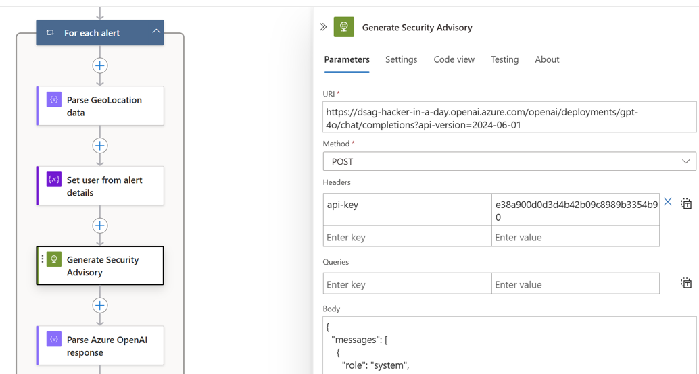
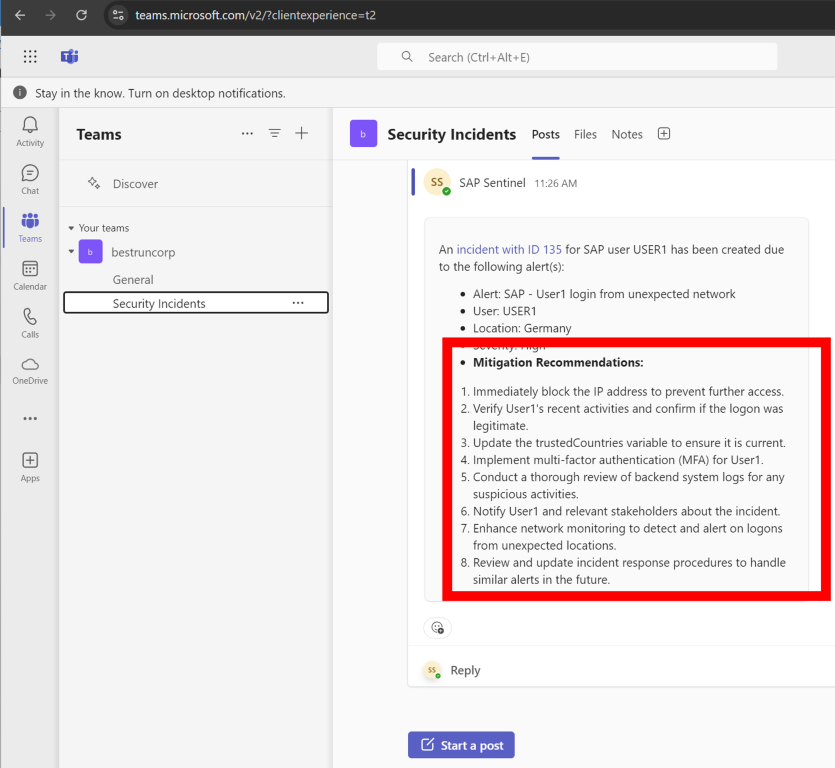

# Quest 5 - Generate a remediation with GPT based on your custom rule (Experts | optional)

[< Quest 4 ](quest4.md) - **[🏠Home](../README.md)** - [ Quest 6 >](quest6.md)

In quest 3 you configured simple alert forwarding to a Microsoft Teams Channel using a playbook (aka Azure LogicApp). Enhance your playbook with a suggested remediation generated by a large language model.

* Explore the [HTTP connector for Logic Apps](https://learn.microsoft.com/en-us/azure/connectors/connectors-native-http?tabs=consumption#connector-technical-reference) to call the OpenAI REST API in your playbook

* Take a look at the [OpenAI Chat Completion API](https://platform.openai.com/docs/guides/chat-completions/overview) and learn about the `system` and `user` roles in the API

* Craft a `system` prompt for the [Chat Completion API](https://platform.openai.com/docs/guides/chat-completions/overview) to generate a meaningful remediation message based on your alert. Follow [best practices for prompt engineering](https://learn.microsoft.com/en-us/azure/ai-services/openai/concepts/advanced-prompt-engineering?pivots=programming-language-chat-completions#system-message) and consult the Web for [cyber-security prompts](https://github.com/DummyKitty/Cyber-Security-chatGPT-prompt)

* Think of a good `user` prompt that instructs the model to compose mitigation recommendations based on the `Alert Description`.

> [!TIP]
> Use `plain text` as the format and set a limit of 100 words for the OpenAI-generated recommendations to make them fit to the Adaptive Card output in Microsoft Teams.

* The following parameters may be useful when implementing the OpenAI integration. :
  * Target URI: https://dsag-hacker-in-a-day.openai.azure.com/openai/deployments/gpt-4o/chat/completions?api-version=2024-06-01
  * API Version: `2024-06-01`
  * Azure OpenAI API Key: `e38a900d0d3d4b42b09c8989b3354b90`

<p align="center" width="100%">

</p>

* When you want to [Parse the JSON](https://learn.microsoft.com/en-us/azure/logic-apps/logic-apps-perform-data-operations?tabs=consumption#parse-json-action) response from Azure OpenAI, the following schema might be useful:
``` json
{
    "type": "object",
    "properties": {
        "choices": {
            "type": "array",
            "items": {
                "type": "object",
                "properties": {
                    "finish_reason": {
                        "type": "string"
                    },
                    "index": {
                        "type": "integer"
                    },
                    "message": {
                        "type": "object",
                        "properties": {
                            "content": {
                                "type": "string"
                            },
                            "role": {
                                "type": "string"
                            }
                        }
                    }
                },
                "required": [
                    "finish_reason",
                    "index",
                    "message"
                ]
            }
        },
        "created": {
            "type": "integer"
        },
        "id": {
            "type": "string"
        },
        "model": {
            "type": "string"
        },
        "object": {
            "type": "string"
        },
        "system_fingerprint": {
            "type": "string"
        },
        "usage": {
            "type": "object",
            "properties": {
                "completion_tokens": {
                    "type": "integer"
                },
                "prompt_tokens": {
                    "type": "integer"
                },
                "total_tokens": {
                    "type": "integer"
                }
            }
        }
    }
}
```

* Consider changing the default [`temperature`](https://gptforwork.com/guides/openai-gpt3-temperature) value to create precise security recommendations

* The enhanced Teams notification with the security recommendations might look as this: 

<p align="center" width="100%">

</p>

> [!NOTE]
> This quest empowered you to design your own specialized remediation suggestions. See the [Copilot for Security documentation](https://microsoft.github.io/PartnerResources/skilling/microsoft-security-academy/microsoft-copilot-for-security#use-cases) for more info on out-of-the-box remediation suggestions.

## Update the [leaderboard](https://forms.office.com/r/aYH8rh7vp5) with your progress⏱

## Where to next?

[< Quest 4 ](quest4.md) - **[🏠Home](../README.md)** - [ Quest 6 >](quest6.md)

[🔝](#)
